# Dance Booking Web Application

This is a coursework project for Web Application Development 2.  
It allows users to browse and book dance classes, while organisers can manage courses, view bookings, and control user access.

---

## Features

### For Members (Users):
- Register and log in
- Browse available courses
- Book a course
- View and cancel their own bookings

### For Organisers:
- Log in as an admin
- Add, edit, and delete courses
- View course bookings
- Add or remove other organisers
- View and remove registered users

---

## Authentication

The app uses JSON Web Tokens (JWT) to manage sessions:
- Members and organisers are kept separate
- Secure login and cookie-based authentication
- Passwords are hashed using `bcrypt`

---

## Technologies Used

| Stack | Description |
|-------|-------------|
| Node.js | Backend runtime |
| Express.js | Server framework |
| Mustache | Templating engine |
| NeDB | Lightweight database (file-based) |
| bcrypt | Password hashing |
| jsonwebtoken | Authentication via JWT |
| Bootstrap 5 | Frontend layout and styling |
| Render | Hosting the deployed app |
| GitHub | Version control and repo |

---

## Architecture

The application follows an **MVC structure**:
- `models/` handles data (courses, bookings, users)
- `controllers/` processes requests and renders views
- `routes/` maps endpoints to controllers
- `views/` contains Mustache templates with shared header/footer

---

## Coursework Notes

- Bootstrap was not required but was intentionally used as comfortable styling tool to meet the “user-friendly interface” requirement.
- The entire app was built in VS Code and deployed using Render.

---

## How to Run Locally

Create an `.env` file in the root folder and add:

PORT=3000
ACCESS_TOKEN_SECRET=yourRandomStringHere

Run by this commands:

npm install
node index.js

And then access through "http://localhost:3000" address

### Default Admin Account (for testing/reset)
If no organiser exists, a default admin will be created on startup:

- Username: `admin`
- Password: `admin`

## Project Screenshots

### Homepage
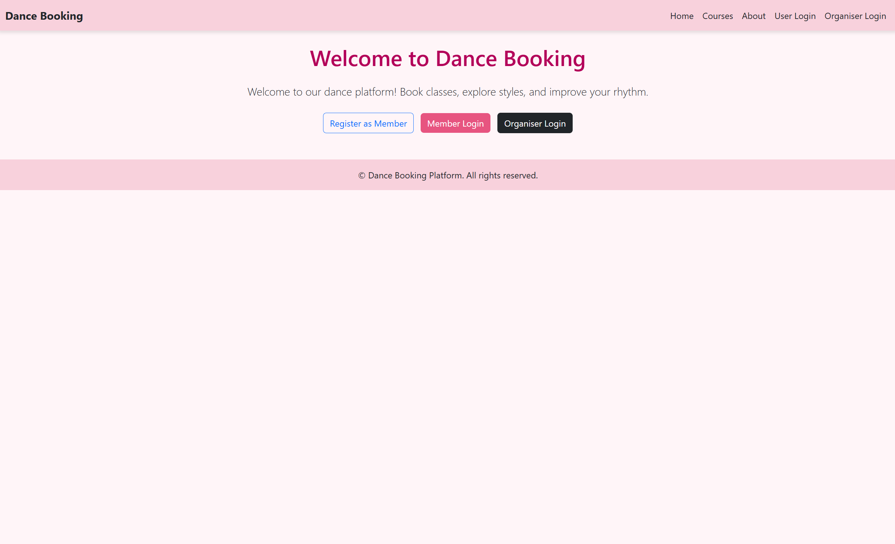

### Organiser Dashboard
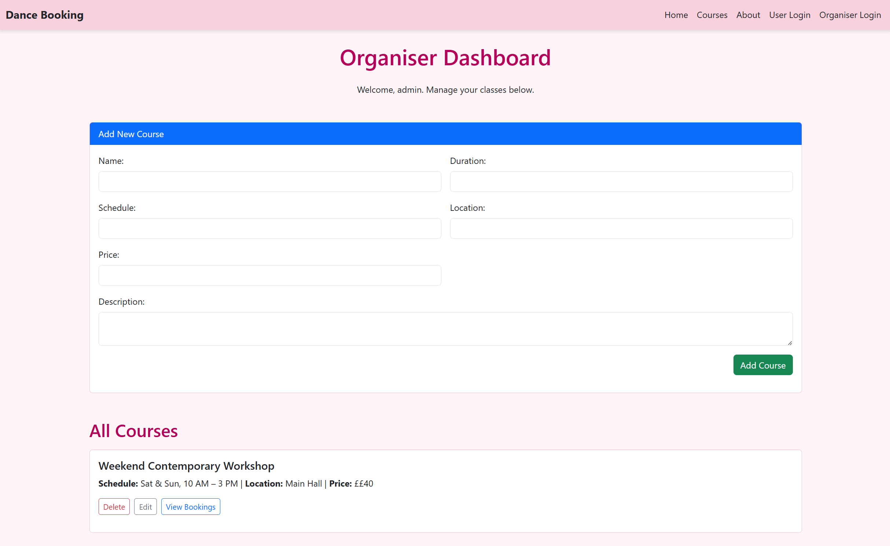

### My Bookings (Member View)
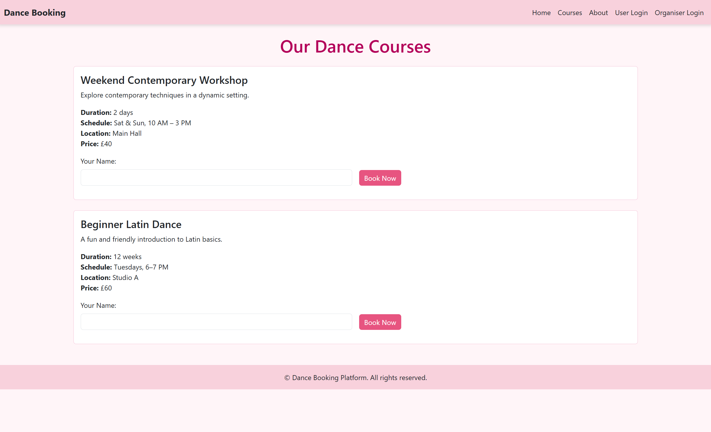

## Testing

Manual testing was conducted for all major features. Each test was performed using valid inputs and compared with the expected result.

| Test ID | Feature | Input | Expected Output | Pass/Fail | Screenshot |
|--------|---------|-------|------------------|-----------|------------|
| T1 | Organiser login | `admin/admin` | Redirect to dashboard | Pass | 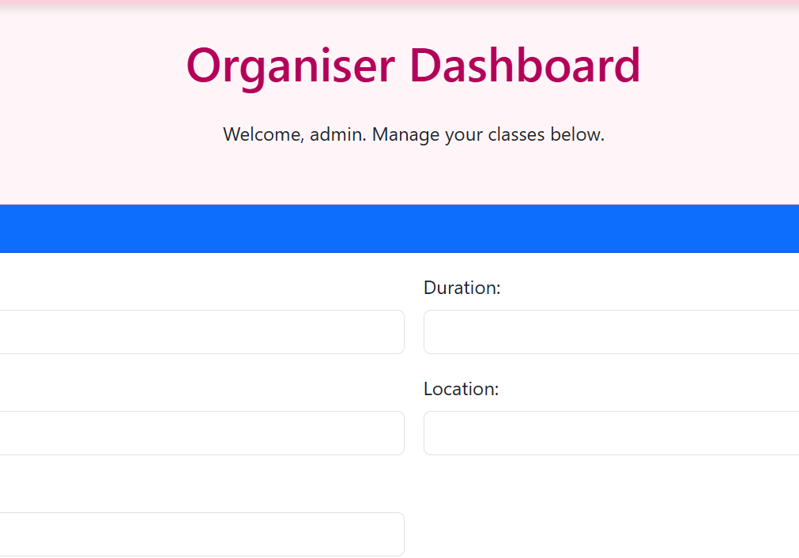 |
| T2 | Member registration | New username & password | Redirect to login page | Pass | 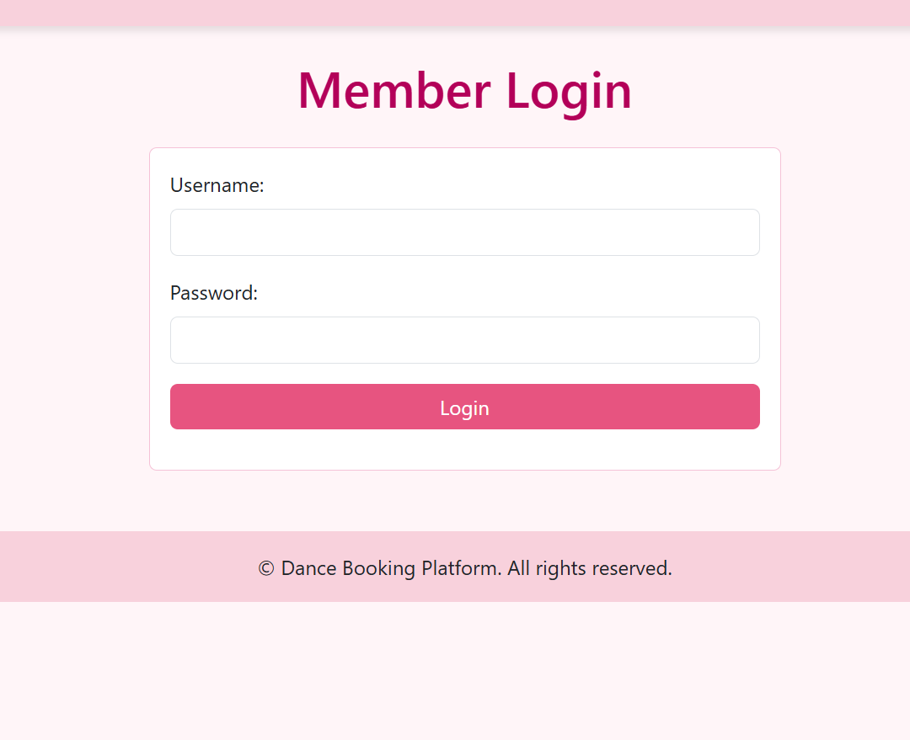 |
| T3 | Book course | Valid name input | Course booked, appears in organiser view | Pass | 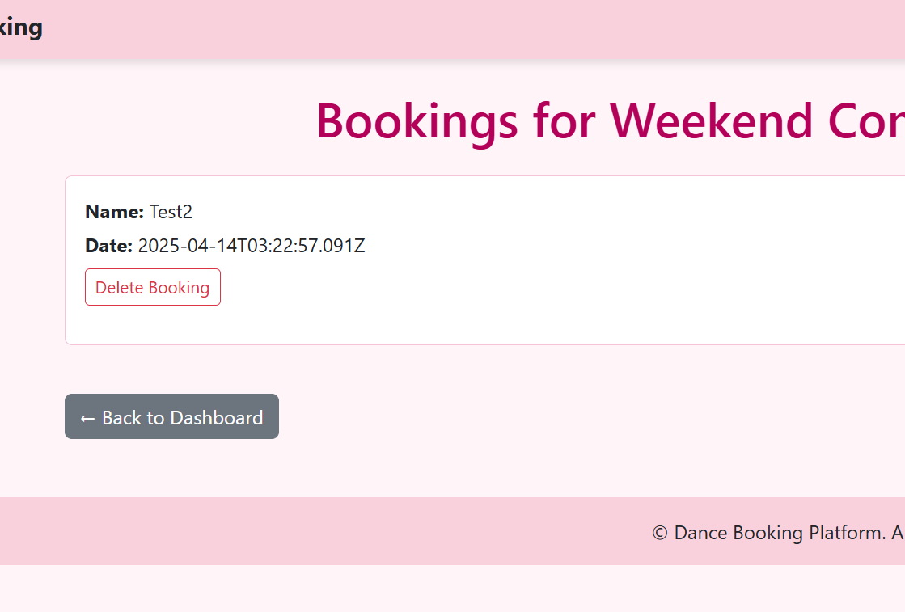 |
| T4 | Cancel booking (user) | Click “Cancel Booking” | Booking removed from user and organiser views | Pass | 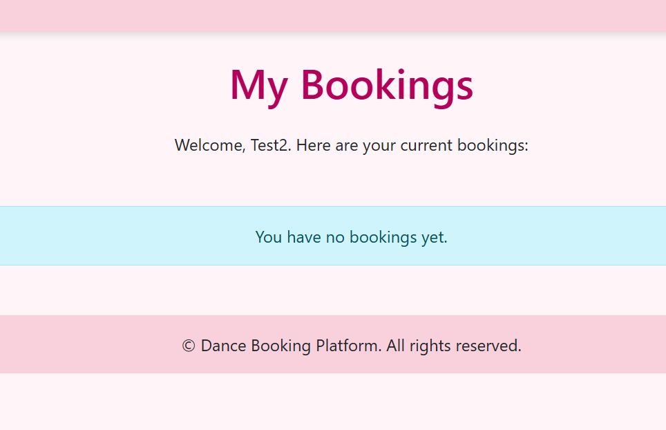 |
| T5 | Add course | Complete course form | Course appears on homepage and dashboard | Pass | 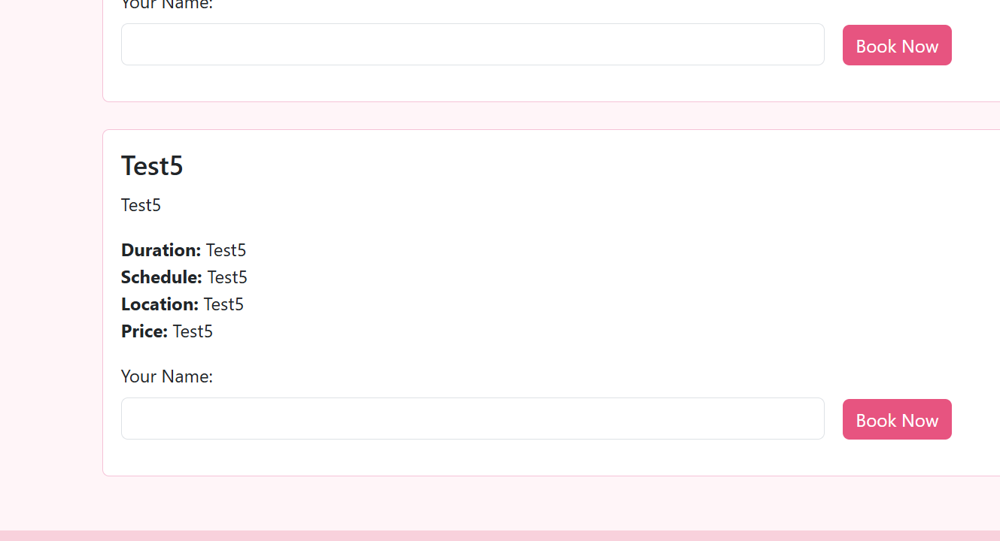 |
| T6 | Edit course | Update fields | Dashboard shows updated course info | Pass | 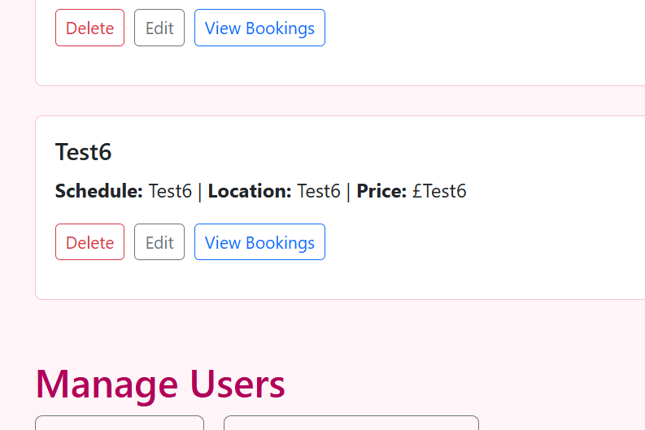 |
| T7 | Delete course | Click delete | Course is removed | Pass | 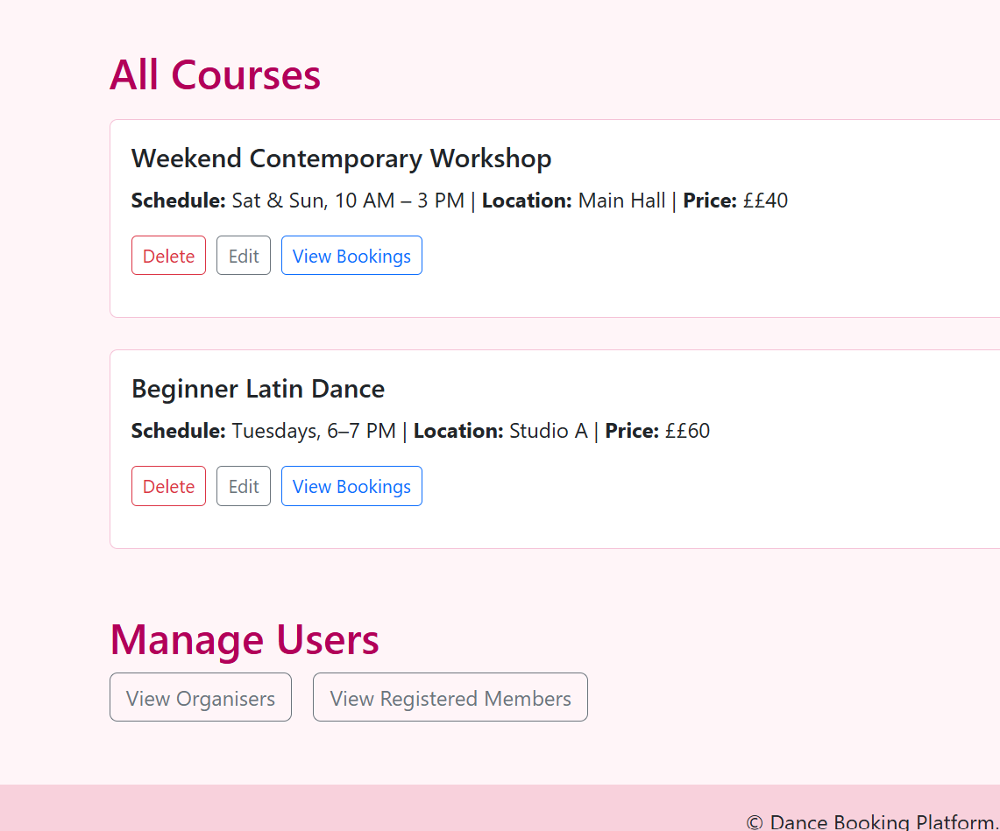 |
| T8 | View bookings (organiser) | Open View Bookings | Show list of users for that course | Pass | 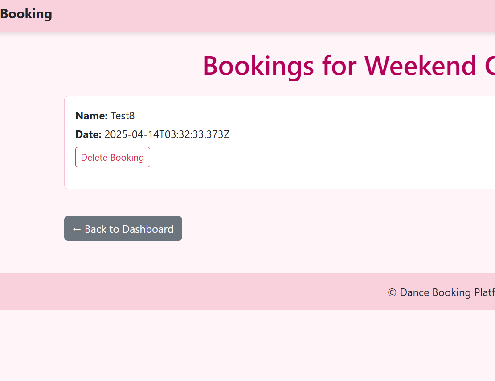 |
| T9 | Add organiser | Fill username/password | New organiser visible in list | Pass | 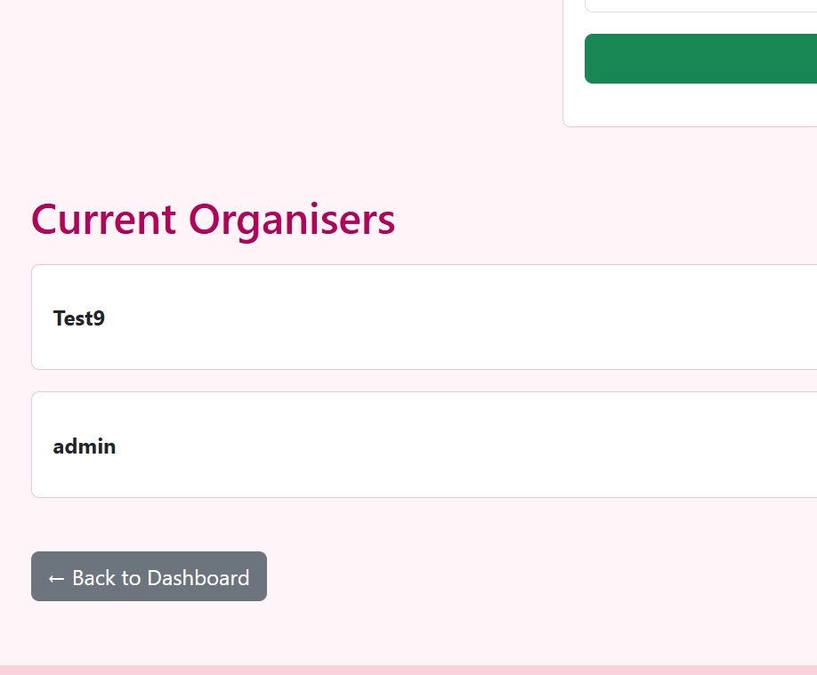 |
| T10 | Delete organiser | Click delete | Organiser is removed | Pass | 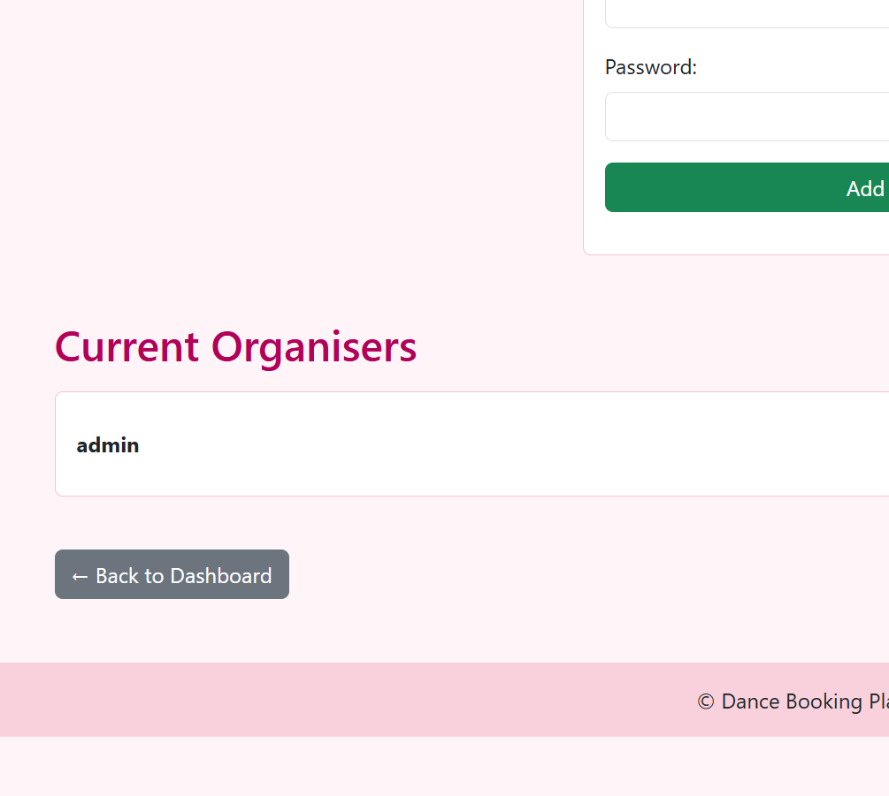 |
| T11 | Member login | Correct credentials | Redirect to My Bookings | Pass | 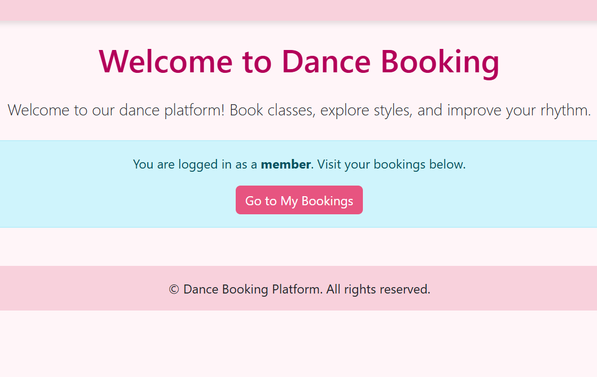 |
| T12 | View My Bookings | Visit `/my-bookings` | User sees their bookings | Pass | 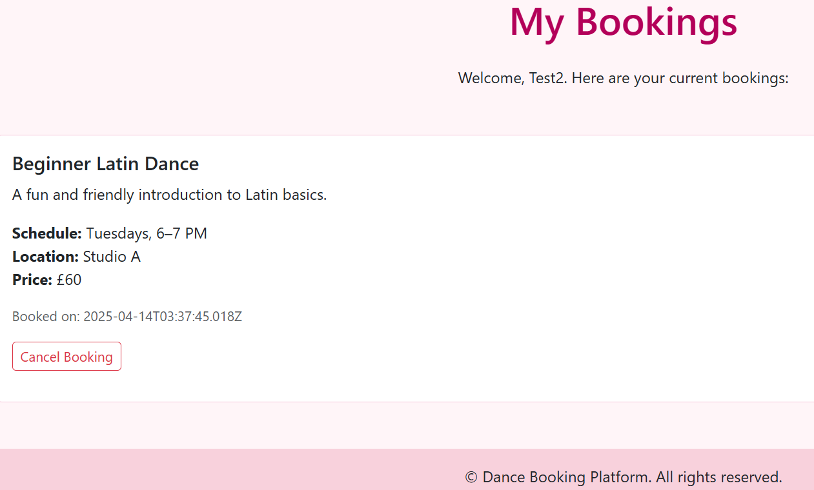 |
| T13 | Protected routes | Try `/dashboard` without login | Redirect to login or access denied | Pass | 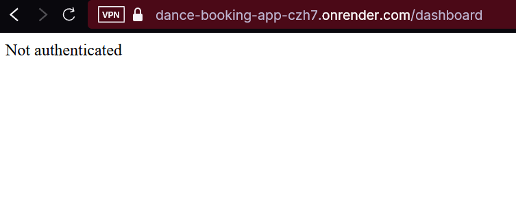 |

## Testing Summary

Manual testing was completed for all core functionality. All features were tested against expected behaviour and passed. 13 out of 13 tests were passed succesfully showing expected output.

## Live website for observing and testing

Render link: https://dance-booking-app-czh7.onrender.com

Please note that Render puts all free hosted websites on sleepmode before after 15 minutes of inactivity, so when you go to the website using the link above, please be patient and wait for around 20-60 seconds, thank you.
